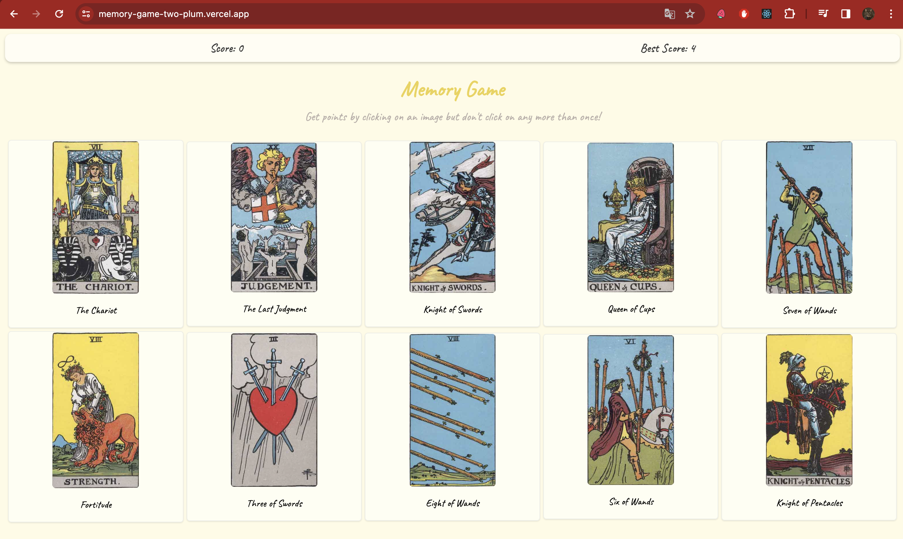

# Memory Game with Tarot Cards



This memory game is a fun and engaging way to test your memory. The game is built with React and uses Tarot cards as the theme. Each round, players click on a card to reveal its image and must remember the position of each card to match pairs.

## Live Demo

You can play the game live at: [Memory Game](https://memory-game-two-plum.vercel.app/)

## Features

- Dynamic card shuffling using Fisher-Yates algorithm.
- Score tracking with best score saved in local storage.
- Responsive design for playing on various devices.
- Animation effects for card flipping and shuffling.

## Technologies Used

- React.js
- HTML
- CSS
- JavaScript

## Tarot Card API

The game uses the [Tarot Card API](https://github.com/ekelen/tarot-api) to dynamically load the images and descriptions of Tarot cards.

## Images Source

Images for the Tarot cards are sourced from [The Internet Sacred Text Archive](https://sacred-texts.com/tarot/xr/), which provides public domain images of classic Tarot cards.

## Educational Purpose

This project is part of the [The Odin Project](https://www.theodinproject.com/lessons/node-path-react-new-memory-card#project-solution) curriculum, which offers a complete path for users to learn web development.

## Lessons Learnt

The development of this memory game was instrumental in enhancing my understanding of several React and JavaScript concepts. Here's what I've learnt:

- **React Hooks:** I gained hands-on experience with React hooks, understanding how to use `useState` for state management and `useEffect` for side effects. This project solidified my knowledge of these hooks in practical scenarios, such as shuffling cards and saving scores.
- **Custom Hooks:** Building custom hooks allowed me to extract component logic into reusable functions. I learned how to encapsulate game logic within a custom hook, leading to cleaner and more maintainable components.
- **Effect Cleanup:** I learned the importance of cleaning up effects in `useEffect` to prevent memory leaks and performance issues, especially when setting up and tearing down event listeners or timers.
- **State Dependency in Effects:** I discovered how to properly manage dependencies in effect hooks, ensuring that effects run only when certain state variables change, which is crucial for performance optimization.

This project has been a significant step in my journey to mastering React and modern JavaScript, and I'm looking forward to applying these concepts to future projects.


## Local Development

To run this project locally, clone the repository and install the dependencies:

```bash
git clone https://github.com/YOUR_GITHUB/YOUR_PROJECT.git
cd YOUR_PROJECT
npm install
npm start


